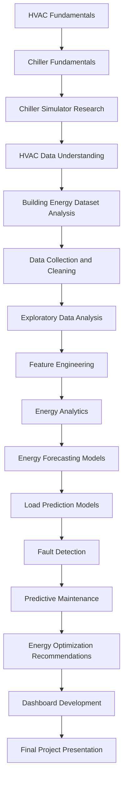

# 3-Month Internship Plan

## Project: HVAC/Chiller Energy Optimization Using Data Analytics & Machine Learning

### Business Objective
Build a strong, practical foundation to reduce HVAC/chiller energy consumption and improve chiller performance using historical HVAC/chiller data, simulation tools, analytics, and machine learning.

---

### Internship Flow (Actual Learning Journey)


---

### 12-Week Roadmap

| Month | Focus Area | Weekly Outcomes | Deliverables |
| :--- | :--- | :--- | :--- |
| **Month 1** | Foundations + Data Setup | HVAC/chiller concepts, simulator study, dataset profiling, data pipeline setup | Problem statement, dataset dictionary, cleaned baseline dataset |
| **Month 2** | Modeling + Diagnostics | Forecasting, load prediction, anomaly/fault logic, maintenance indicators | Baseline ML models, model comparison notebook, fault detection prototype |
| **Month 3** | Optimization + Productization | Recommendation logic, dashboard, business impact storytelling | Optimization report, Streamlit dashboard, final presentation |

---

### Detailed Week-by-Week Plan

| Week | Theme | Tasks | Success Criteria |
| :--- | :--- | :--- | :--- |
| **1** | HVAC Fundamentals | Understand HVAC cycle, COP, kW/RT, part-load behavior | Can explain system operation and key KPIs clearly |
| **2** | Chiller Fundamentals | Study chiller types, efficiency curves, operating constraints | Can map controllable vs uncontrollable variables |
| **3** | Simulator Research | Explore EnergyPlus/OpenStudio workflows and outputs | Simulation run completed for a sample case |
| **4** | Data Understanding | Study schema, tags, sensor frequency, missing data patterns | Data dictionary and data quality report complete |
| **5** | Data Collection and Cleaning | Merge sources, fix timestamps, handle nulls/outliers | Reproducible preprocessing notebook |
| **6** | EDA | Trend, seasonality, weather sensitivity, load signatures | EDA dashboard and insight summary |
| **7** | Feature Engineering | Build lag, rolling, weather and schedule features | Feature store table ready for modeling |
| **8** | Energy Analytics | Analyze intensity, peak demand, baseline usage patterns | KPI pack with baseline metrics |
| **9** | Energy Forecasting | Train and compare Prophet/XGBoost/ML baselines | Best forecasting model selected |
| **10** | Load Prediction | Build short-term load prediction model | Load model meets target error threshold |
| **11** | Fault and Maintenance | Fault flags, drift detection, maintenance indicators | Fault detection and PM scoring prototype |
| **12** | Optimization and Presentation | Recommendation logic, dashboard polish, final story | Executive-ready demo and final report |

---

### Detailed Weekly Documents
* Week 01 - HVAC and Chiller Fundamentals
* Week 02 - Chiller Simulator and Digital Twin
* Week 03 - HVAC Data and Energy Datasets
* Week 04 - Exploratory Data Analysis
* Week 05 - Data Cleaning and Feature Engineering
* Week 06 - Energy Analytics
* Week 07 - Machine Learning Fundamentals
* Week 08 - Load Forecasting
* Week 09 - Fault Detection
* Week 10 - Predictive Maintenance
* Week 11 - Energy Optimization Engine
* Week 12 - Capstone Project

---

### Recommended Open-Source Tech Stack
* **Development:** Python 3.11+, VS Code, Git, GitHub
* **Data Analytics:** Pandas, NumPy, Jupyter Notebook
* **Visualization:** Matplotlib, Plotly
* **Machine Learning:** Scikit-Learn, XGBoost, Prophet
* **Dashboard:** Streamlit
* **Database:** PostgreSQL
* **HVAC Simulation:** EnergyPlus, OpenStudio
* **Public Datasets:** ASHRAE Energy Dataset, Building Data Genome, UCI Energy Efficiency Dataset

---

### KPI Targets

| KPI | Baseline | Target | Why It Matters |
| :--- | :--- | :--- | :--- |
| **Chiller Plant kW/RT** | 0.85 | <= 0.72 | Direct energy efficiency improvement |
| **Forecast MAPE** | 18% | <= 10% | Better planning and control |
| **Peak Demand** | 100% | -8% to -12% | Cost reduction from peak shaving |
| **Fault Detection Precision** | 0.60 | >= 0.80 | Fewer false alarms, better trust |

---

### Suggested Folder Structure

```
project-root/
├── data/
│   ├── raw/
│   └── processed/
├── notebooks/
│   ├── 01_data_understanding.ipynb
│   ├── 02_eda.ipynb
│   ├── 03_feature_engineering.ipynb
│   ├── 04_forecasting.ipynb
│   ├── 05_load_prediction.ipynb
│   └── 06_fault_detection.ipynb
├── src/
│   ├── data_pipeline/
│   ├── features/
│   ├── models/
│   ├── optimization/
│   └── dashboard/
├── reports/
└── assets/
```

---

### Final Project Outputs
* End-to-end reproducible analytics and ML workflow
* Forecasting and load prediction model results
* Fault detection and predictive maintenance prototype
* Energy optimization recommendation engine (rule-based + model insights)
* Streamlit dashboard for operations and management
* Final presentation with quantified business impact

---

### Final Presentation Storyline
* Business problem and energy cost impact
* Data landscape and preprocessing strategy
* EDA insights and key inefficiencies
* Model results (forecasting + load + fault)
* Optimization recommendations and expected savings
* Dashboard walkthrough
* Risks, assumptions and next-phase roadmap