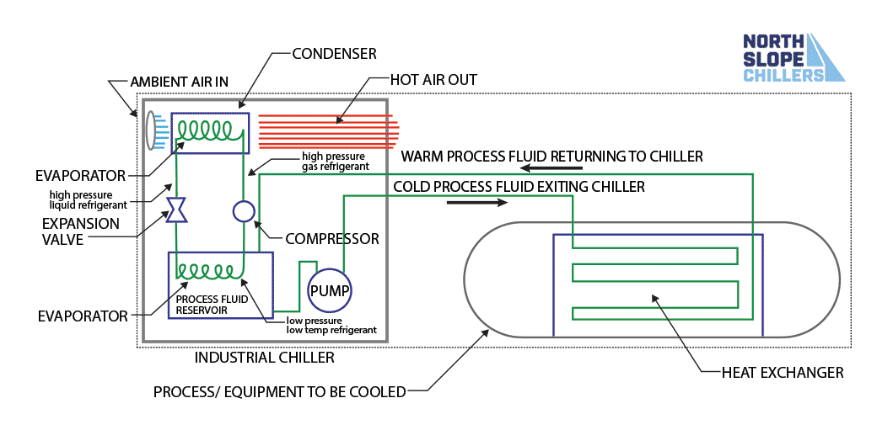

# Chiller Simulator
Study Objective: Map physical thermodynamic HVAC models to ML data pipelines for synthetic data generation and predictive maintenance.

### **Industry Context: HVAC & Energy**
* **Data (HVAC)**: 
    * HVAC (Heating, Ventilation and Air Conditioning)
    * The data consists of continuous IoT telemetry streaming from these physical systems
* **Energy**: 
    * Chillers are massive power sinks, consuming up to 40-50% of a commercial building's total electricity
    * Maximizing the COP directly saves megawatts of power + reduces carbon emissions.
* **Usage in Industry**: 
    * **Data Centers**: Providing zero-downtime, precision cooling for servers running AI workloads.
    * **Manufacturing/Pharma**: Maintaining strict climate control to prevent chemical spoilage or material warping.
    * **Smart Real Estate**: Predictive cooling based on fluctuating electricity tariffs (load shifting).

### **Physical Model of a Chiller**
Chiller is a cyclic state machine. It uses a liquid refrigerant to continuously absorb heat from an indoor environment (chilled water loop) and reject it to an outdoor environment (condenser water loop).

*NOTE: Refridgerant is our "data packet" here*

1. **Evaporator (Heat Absorption)**
    * Warm building water flows over cold refrigerant. Refrigerant boils into a gas.
    * Cooling load is calculated via:
    
    $$Q_{\text{evap}} = \dot{m} \cdot C_p \cdot \Delta T_{\text{water}}$$

    * Where:
        * $\dot{m}$ = mass flow rate of water
        * $C_p$ = specific heat of water
        * $\Delta T$ = temperature difference between entering and leaving water

2. **Compressor (Work Input)**
    * The "CPU" of the chiller
    * It crushes the gas → spiking its pressure and temperature
    * Draws massive electrical power ($W_{\text{comp}}$)

3. **Condenser (Heat Rejection)**
    * Hot gas dumps heat to the outside atmosphere and turns back into a liquid.
    * Law of Conservation: Total heat out must equal heat absorbed plus work put in: 
    $$Q_{\text{cond}} = Q_{\text{evap}} + W_{\text{comp}}$$

4. **Expansion Valve (Pressure Drop)**
    * High-pressure liquid is forced through a pinhole, rapidly dropping pressure and temperature to restart the cycle.

### **The Simulator (Math → Synthetic Data)**
Real-world chillers are too expensive to let fail. Datasets are heavily skewed (99.9% normal operation, 0.1% failure).
Simulators act as "Digital Twins" to synthesize the missing failure data.

* **White-Box Simulators (Physics Engines)**: 
    * Uses rigid Ordinary Differential Equations (ODEs) to calculate exact thermodynamics. 
    * Highly accurate but computationally very slow.

* **Black-Box Simulators (AI Surrogates)**: 
    * Neural networks trained to mimic the White-Box simulator 
    * They take ambient conditions as input; and output the sensor states instantly
    * This bypasses slow ODE solvers

* **Fault Injection**: 
    We program the simulator to degrade.
    * Eg: Gradually decrease the condenser's heat transfer coefficient. This simulates physical dirt buildup (fouling); and creates a labeled dataset for an anomaly detection model.

### **The Data Engineering Pipeline**
IoT sensors dump messy, high-frequency time-series arrays.

Raw voltages are useless without feature engineering:
* **Denoising**: 
    * IoT data has severe electrical noise
    * Apply FFT or moving averages to smooth the signals before feeding them to models.
* **Target Feature (COP)**: 
    * COP : Coefficient of Performance
    * This is the holy grail metric
    * $$\text{COP} = \frac{Q_{\text{evap}}}{W_{\text{comp}}}$$
* **Vector Management & Reshaping**: 
    * Strict shape management is required when extracting derived features (like a 1D array of approach temperatures) for classical classification.
    * You must explicitly reshape the arrays (eg: using `.reshape(-1, 1)`) before passing them to statistical estimators like an SVM to avoid zero-dimensional shape errors during training.

### **Why Train for ML?**
* **Fault Detection and Diagnostics (FDD)**: To shift from reactive repairs to predictive maintenance (identifying mechanical wear and tear before it causes a breakdown).
* **Energy Optimization**: ML models (like Reinforcement Learning agents) can dynamically adjust operational setpoints to optimize energy usage far better than static, hardcoded rules.
* **Surrogate Modeling**: Replacing computationally slow physical simulators with instantaneous AI approximations.

### **Top-Layer ML Architectures**
Some examples of how modern AI tackles HVAC diagnostics:

1. **Physics-Informed Neural Networks (PINNs)**
    * Standard neural networks only minimize Mean Squared Error (MSE) on the training data.
    * PINNs add a thermodynamic penalty to the loss function.
    * If the neural network predicts sensor values that violate $Q_{\text{cond}} = Q_{\text{evap}} + W_{\text{comp}}$ ⇒ the loss spikes.
    * This forces the AI to obey the laws of physics.
2. **Spatial-Temporal Graph Networks**
    * A chiller is a physical graph.
    * Nodes: Evaporator, Compressor, Condenser.
    * Edges: Refrigerant flow vectors.
    * By mapping this topological structure, Graph Neural Networks can learn how a localized fault (eg: a tiny leak at an edge) propagates through the nodes over time ⇒ offers vastly superior root-cause analysis compared to flat tabular arrays.
3. **Agentic Orchestration**
    * Instead of one giant model, deploy a multi-agent system:
        * Context Agent: Continuously queries the IoT database for fresh time-series batches.
        * Orchestrator Agent: Analyzes the baseline. If an anomaly is detected, it routes the data to a specific micro-model (eg: an SVM tuned solely for Condenser faults).
        * Healer/Alert Agent: Synthesizes the model outputs into a human-readable alert and logs the diagnostic trace.