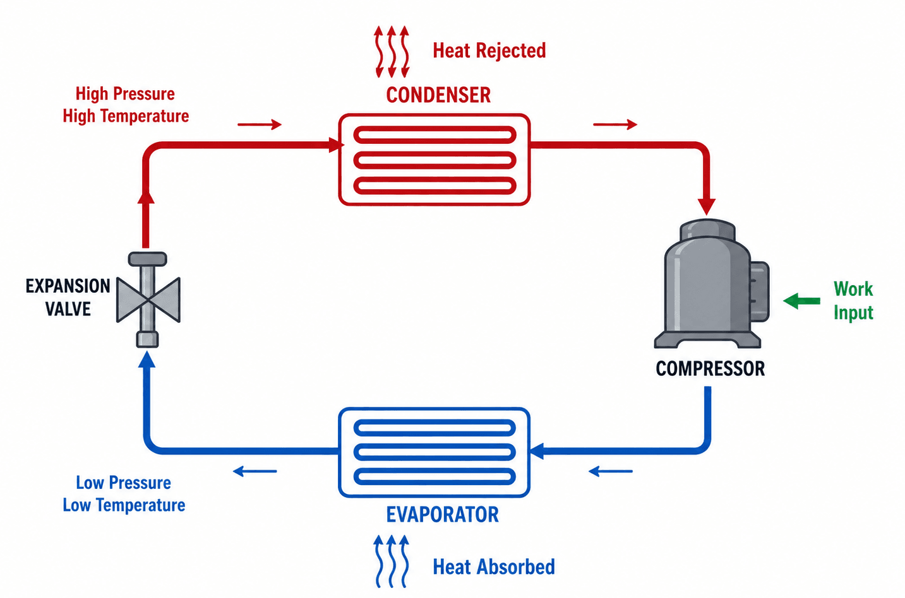

# **Task-1: Chiller Simulator Research**

### **1.1 What is a chiller simulator?**
* It is a high-fidelity software environment or digital twin that models the thermodynamic, fluid dynamic, and electrical behavior of an industrial chiller system. 
* It uses mathematical equations (rooted in laws of physics like the conservation of energy and mass) to replicate real-world reactions (instead of actually interacting with physical hardware).

Uses of a chiller simulator:
* Data Generation: Creates realistic synthetic sensor data (temperatures, pressures, flow rates) under safe conditions.
* Edge-Case Testing: Simulates rare, catastrophic failure modes (e.g., refrigerant leaks, compressor slugging, tube fouling) without damaging expensive machinery.
* Control Loop Validation: Acts as a sandbox for testing automation scripts and Machine Learning algorithms before deploying them to production environments.

### **1.2 How does a chiller system work?**
* Industrial chillers operate on the principle of **Vapor Compression Refrigeration**
* The goal is to continuously remove heat from an internal building loop (chilled water) and reject it to the outside environment.

The continuous thermodynamic cycle follows four main stages:
1. **Phase 1: Evaporation (Heat Absorption)** 
    * Low-pressure, cold liquid refrigerant enters the evaporator
    * Warm return water from the building passes through the evaporator tubes
    * Refrigerant absorbs this heat ⇒ water cools down and the refrigerant boils into a low-pressure gas.

2. **Phase 2: Compression (Pressure & Temperature Boost)** 
    * This low-pressure refrigerant vapor is drawn into the compressor
    * Compressor mechanically squeezes the gas
    * This drastically raises its pressure, density and temperature ⇒ converts it into a superheated, high-pressure gas.

3. **Phase 3: Condensation (Heat Rejection)** 
    * This hot, high-pressure gas enters the condenser
    * Cooler water from a cooling tower loop (or ambient air) passes through the condenser
    * The refrigerant rejects its heat into this water loop ⇒ refrigerant gas cools down and condenses back into a high-pressure liquid.

4. **Phase 4: Expansion (Pressure Drop)** 
    * This high-pressure liquid passes through an expansion valve
    * The valve restricts flow ⇒ creates a sudden pressure drop
    * This flash-evaporates a small portion of the liquid ⇒ instantly lowers the temperature and pressure of the remaining refrigerant ⇒ prepares it to re-enter the evaporator.

### **1.3 Key Physical Components**

A complete industrial chiller plant relies on several interconnected mechanical and electrical assets:

1. **Compressor**: 
    * Mechanical heart of the system
    * It drives the refrigerant flow
    * Common industrial types include Centrifugal (for massive loads), Screw, Scroll compressors.

2. **Evaporator**: 
    * Heat exchanger where heat transfers from the building's chilled water loop to the cold refrigerant.

3. **Condenser**: 
    * Heat exchanger that transfers heat out of the hot refrigerant gas into an external cooling medium (water or air).

4. **Auxillary Plant Loops (Pumps and cooling towers)**
    * **Cooling Tower**: 
        * Used in water-cooled systems
        * It receives hot water from the condenser, sprays it into the air and uses evaporative cooling to reject the heat into the atmosphere.

    * **Chilled Water Pumps (CHWPs)**: 
        * Circulate the cooled water from the evaporator out to the building's air handling units (AHUs) and fan coil units (FCUs).

    * **Condenser Water Pumps (CWPs)**: 
        * Circulate water between the condenser and the outdoor cooling tower.

5. **Thermal Expansion Valve (TXV/EEV)**: 
    * A precision metering device that regulates the exact amount of refrigerant entering the evaporator based on cooling load demands.

### **1.4 Industrial Applications of Chiller Simulators**
Simulators are essential in high-stakes environments 
(where unexpected downtime or energy inefficiencies result in massive financial losses):

* **Data Centers**: Modern facilities run high-density AI and cloud compute workloads. Simulators model dynamic thermal profiles to ensure chiller plants maintain precise temperatures ⇒ prevent server throttling + optimize Power Usage Effectiveness (PUE).

* **Pharmaceutical & Food Processing**: Precise temperature maintenance is critical for chemical stability and cold-chain logistics. Simulators train systems to handle sudden changes in heat loads without ruining batches.

* **Smart Building Management (BMS)**: Facilities management companies use simulators to test control algorithms like Demand-Controlled Ventilation and Night Purge systems before deploying them to physical skyscrapers.

* **Industrial Manufacturing**: Plastics, automotive assembly, semiconductor fabrication, etc. require consistent process cooling. Simulators prevent thermal shock in machinery during production line scale-ups.

### **1.5 Real-world Examples of Chiller Simulators**
1. 6SigmaET / FutureFacilities (Data Center Specialist Twin)
    * It is a dedicated data center physics and CFD simulator.  
      
2. GT-SUITE / GT-DataCenter (Gamma Technologies)
    * It is a multi-physics platform that models transient thermal systems, linking chillers, internal cooling loops, and air handlers.
    * It generates clean synthetic data to train Model Predictive Control (MPC) and neural network loops without risking physical hardware.

3. SimScale (Cloud-Native Thermal AI)
    * It is a cloud-based CFD platform that uses physics-trained AI surrogate models.  
    * It simulates structural pump failures and rare anomalies to create training data for Fault Detection and Diagnostics (FDD) classifiers.

4. EcoStruxure IT Advisor / Digital Twin (Schneider Electric India)
    * It is a real-time digital twin architecture heavily deployed across hyperscale data centers in India.  
    * It models how India's harsh summer spikes degrade a centrifugal chiller's Coefficient of Performance (COP). It uses historical data to predict thermal tracking and lower facility PUE. 

5. Delta Precision Twin Framework (Delta Electronics India)
    * It is a hardware-in-the-loop (HIL) fluid dynamics simulation ecosystem built for massive Indian ICT infrastructures.  
    * It models multi-phase fluid dynamics under fluctuating local grid conditions. This provides the baseline data needed to deploy fail-safe edge AI models directly on local chiller controllers.

# **Task-2: HVAC/Chiller Data for Machine Learning**

### **2.1 What types of HVAC/Chiller data are collected?**
Industrial chiller plants capture high-frequency time-series data via SCADA (Supervisory Control and Data Acquisition) systems, programmable logic controllers (PLCs) and IoT edge gateways.

This data falls into these engineering domains:
1. Thermodynamic Data: Temperature and pressure states of the refrigerant across its phase-change cycle.
2. Fluid Dynamics Data: Volumetric and mass flow rates of the water loops moving heat through the facility.
3. Electrical & Mechanical Data: Power consumption metrics from heavy inductive loads and structural mechanical health indicators.
4. Environmental & Contextual Data: Ambient atmospheric boundary conditions and building-side performance metadata.

### **2.2 Critical parameters for ML input features**
Raw sensor feeds must be engineered into high-impact features. These parameters serve as the primary independent variables ($X$) or target variables ($Y$) in HVAC machine learning pipelines:

1. **Electrical & System-Wide:**
    * **Compressor Motor Current / Power ($kW$):** Real-time power draw of the compressor motor.
    * **Cooling Load ($Q$):** Calculated continuously via thermodynamics:
    * $$\text{Load} = \text{Flow Rate} \times \text{Density} \times \text{Specific Heat} \times (\text{CHWRT} - \text{CHWST})$$
    * **Coefficient of Performance (COP) / Efficiency:** The ratio of useful cooling output to electrical power input ($kW/\text{ton}$). The ultimate optimization metric.
    * **Vibration Signatures:** High-frequency 3-axis accelerometer data from compressor bearings (typically reshaped from 1D time-series arrays into fast Fourier transform (FFT) spectrograms).
2. **Evaporator / Chilled Water Loop:**
    * **Chilled Water Supply Temperature (CHWST):** The baseline cooling output temperature delivered to the data center or building (typically 6°C–7°C).
    * **Chilled Water Return Temperature (CHWRT):** The temperature of the water returning after absorbing facility heat.
    * **Evaporator Approach Temperature:** The difference between the leaving chilled water temperature and the refrigerant evaporating temperature. A key indicator of internal tube fouling.
    * **Chilled Water Flow Rate ($Q_{chw}$):** Measured in cubic meters per hour ($m^3/h$) or gallons per minute (GPM). Critical for computing instantaneous thermal work.
3. **Condenser / Cooling Tower Loop:**
    * **Condenser Water Supply Temperature (CWST):** The temperature of the cool water entering the condenser from the cooling tower.
    * **Condenser Water Return Temperature (CWRT):** The temperature of the hot water leaving the condenser bound for the cooling tower.
    * **Condenser Approach Temperature:** The difference between the condensing temperature and the leaving condenser water temperature.Condenser Water Flow Rate ($Q_{cw}$): Tracks the volume of water driving the heat rejection loop.
4. **Refrigerant Circuit:**
    * **Evaporator/Condenser Pressures:** Absolute pressures used to calculate saturation temperatures.
    * **Superheat & Subcooling:** Temperature differentials that ensure no liquid refrigerant enters the compressor inlet (preventing liquid slugging).

### **How is 5-10 years of historical data used for ML?**
A multi-year historical dataset ⇒ makes reactive baselines robust ⇒ helps generalize ML models.

* **True Seasonality & Climate Mapping:** Captures decade-level weather extremes, monsoon humidity shifts (in India) and heatwaves. Prevents models from flagging normal high-load summer behavior as an operational anomaly.

* **Component Degradation Tracking:** Maps slow, multi-year mechanical wear patterns (e.g., micro-fractures in bearings, gradual scale buildup inside condenser tubes). Allows models to learn true asset lifecycle decay curves.

* **Rare Fault Profiling (Class Imbalance Resolution):** Industrial chillers rarely experience catastrophic failures. A 10-year archive provides the rare, historical "ground-truth" error logs needed to train supervised classification models for critical events.

* **Concept Drift Management:** Provides historical baselines across multiple maintenance cycles (e.g., before and after major overhauls or tube cleanings). Helps the ML pipeline distinguish between a hardware modification and an unexpected fault.

### **ML Use Cases**

1. **Energy Forecasting**
    * Algorithms used: LSTM (Long Short-Term Memory) networks, Gated Recurrent Units (GRUs), XGBoost Regressors.
    * Execution: Predicts total facility $kW$ consumption 24 to 48 hours in advance. Utilizes inputs like external ambient wet-bulb temperatures, historical load cycles, and data center IT server schedules.

2. **Fault Detection & Diagnostics (FDD)**
    * Algorithms used: Support Vector Machines (SVM), Random Forests, Isolation Forests (unsupervised).
    * Execution: Classifies and isolates subtle, hidden efficiency losses. Identifies a 5% refrigerant leak or an expansion valve setpoint drift long before a mechanical threshold alarm is triggered.

3. **Predictive Maintenance (PdM)**
    * Algorithms used: Autoencoders (for anomaly detection) and Survival Analysis models (Weibull distribution regression).
    * Execution: Monitored vibration FFT data combined with rising motor amp draws predicts compressor bearing failure weeks in advance. Enables zero-downtime scheduled maintenance during low-load windows.

4. **Real-Time Setpoint Optimization**
    * Algorithms used: Reinforcement Learning (Deep Q-Networks / PPO) and Model Predictive Control (MPC) frameworks.
    * Execution: Dynamically adjusts the chilled water supply temperature setpoint based on real-time load requirements. Raising the setpoint by just 1°C can cut compressor energy consumption by 2% to 3% while strictly preserving data center Power Usage Effectiveness (PUE).

### **References**
1. [WaterChillers Blog - What is a chiller and how does it work?](https://waterchillers.com/blog/how-does-a-chiller-work/)
2. [Oxmaint - AI-powered predictive maintenance for chillers in manufacturing plants](https://oxmaint.com/industries/manufacturing-plant/ai-powered-predictive-maintenance-for-chillers-in-manufacturing-plants)
3. [Medium - Digital Twin Solutions for Data Centers Simulation System Design and Thermal Control](https://medium.com/@gwrx2005/digital-twin-solutions-for-data-centers-simulation-system-design-and-thermal-control-dffe2d1798ad)
4. [Vertiv - Cooling the future how high-capacity chillers are shaping tomorrow's data centers and industry](https://www.vertiv.com/en-emea/insights/articles/blog-posts/cooling-the-future-how-high-capacity-chillers-are-shaping-tomorrows-data-centers-and-industry/)