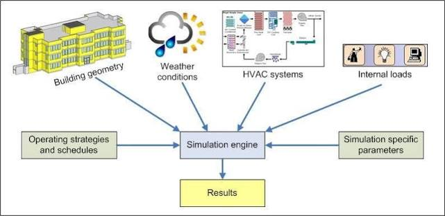

# **Week 02 - Chiller Simulator and Digital Twin**

## **Chiller Simulator Fundamentals + Digital Twins**
* It is a high-fidelity software environment or digital twin that models the thermodynamic, fluid dynamic and electrical behavior of an industrial chiller system.
* It uses mathematical equations (rooted in laws of physics like the conservation of energy and mass) to replicate real-world reactions (instead of actually interacting with physical hardware).

Uses of a chiller simulator:
* **Data Generation**: Creates realistic synthetic sensor data (temperatures, pressures, flow rates) under safe conditions.
* **Edge-Case Testing**: Simulates rare, catastrophic failure modes (e.g., refrigerant leaks, compressor slugging, tube fouling) without damaging expensive machinery.
* **Control Loop Validation**: Acts as a sandbox for testing automation scripts and Machine Learning algorithms before deploying them to production environments.

## **Typical Simulator Inputs**
To train effective AI models or optimization algorithms $\implies$ we must strictly separate the actionable control levers from the external environment.

**Uncontrollable Variables (Environment / State)**
These are external boundary conditions that the system cannot change but must react to.
* Ambient Weather Conditions:
    * Dry-Bulb Temperature: 
        * It is the standard "air temperature"
        * Doesn't account for moisture (humidity).
    * Wet-Bulb Temperature: 
        * Critical for cooling tower efficiency
        * Dictates the absolute thermodynamic limit of the cooling tower.
* Building Cooling Load: It refers to the total dynamic heat generated (by servers / people / industrial processes) that must be actively removed.
* Utility Grid Prices: These refer to dynamic time-of-use electricity tariffs.

**Controllable Variables (Action Space / Setpoints)**
These are the knobs and dials the control system or AI agent can adjust.
* Chilled Water Supply Temperature (CHWST) Setpoint
* Condenser Water Supply Temperature (CWST) Setpoint
* Pump VFD Speeds
* Chiller Sequencing / Staging: The boolean decision of turning individual chiller units ON or OFF.

## **Expected Outputs, KPIs, Sensor Mappings**
Industrial chiller plants capture high-frequency time-series data via SCADA systems, PLCs and IoT edge gateways.

**Data Generated by the Platform (Sensor Mappings):**
1. **Thermodynamic Data**: Temperature and pressure states of the refrigerant across its phase-change cycle.
    * **Evaporator/Condenser Pressures**: Absolute pressures used to calculate saturation temperatures.
    * **Superheat & Subcooling**: Temperature differentials that ensure no liquid refrigerant enters the compressor inlet.
2. **Fluid Dynamics Data**: Volumetric and mass flow rates of the water loops.
    * **Chilled Water Flow Rate**: Measured in cubic meters per hour (m³/h) or gallons per minute (GPM).
    * **Condenser Water Flow Rate**: Tracks the volume of water driving the heat rejection loop.
3. **Electrical & Mechanical Data**: Power consumption metrics from heavy inductive loads and structural mechanical health indicators.
    * **Compressor Motor Current / Power**: Real-time power draw of the compressor motor.
    * **Vibration Signatures**: High-frequency 3-axis accelerometer data from compressor bearings.
4. **Key Performance Indicators (KPIs):**
    * **Coefficient of Performance (COP) / Efficiency**: The ratio of useful cooling output to electrical power input (kW/ton). The ultimate optimization metric.
    * **Cooling Load**: Calculated continuously via thermodynamics.
    $$Load = \text{Flow Rate} \times \text{Density} \times \text{Specific Heat} \times (CHWRT - CHWST)$$

## **How Historical HVAC/Chiller Data is Used for Model Calibration and Validation**
A multi-year historical dataset $\implies$ makes reactive baselines robust $\implies$ helps generalize ML models.

* **True Seasonality & Climate Mapping**: Captures decade-level weather extremes, monsoon humidity shifts and heatwaves. Prevents models from flagging normal high-load summer behavior as an operational anomaly.
* **Component Degradation Tracking**: Maps slow, multi-year mechanical wear patterns (e.g., micro-fractures in bearings, gradual scale buildup inside condenser tubes). Allows models to learn true asset lifecycle decay curves.
* **Rare Fault Profiling (Class Imbalance Resolution)**: A 10-year archive provides the rare, historical "ground-truth" error logs needed to train supervised classification models for critical events.
* **Concept Drift Management**: Provides historical baselines across multiple maintenance cycles (e.g., before and after major overhauls or tube cleanings). Helps the ML pipeline distinguish between a hardware modification and an unexpected fault.

## **5. Simulator Comparison Matrix**

| Feature | EnergyPlus | OpenStudio | Modelica |
| :--- | :--- | :--- | :--- |
| **Model Fidelity** | Macroscopic, whole-building focus; averaged over hourly or sub-hourly time-steps. | Same as EnergyPlus (serves as a graphical wrapper). | High-fidelity, component-level thermodynamic simulation. Equations-based. |
| **Usability** | Text-based input files; steep learning curve for non-architects. | Graphical User Interface with drag-and-drop HVAC templates. | Requires deep technical fluid dynamics/thermodynamics knowledge. |
| **Integration Potential** | Excellent for broad compliance and building-wide energy profiles. | Good for Building Information Modeling (BIM) export/import. | Ideal for Digital Twins, AI control loop reinforcement and synthetic data generation. |
| **Recommendation** | Not ideal for component-level fault detection. | Good for initial baselining. | Recommended for chiller performance optimization and ML fault simulation. |

## **HVAC Simulation Data Flow Diagram**

## **Review Questions**
* **Why use simulation before field deployment?**
    * It acts as a sandbox for testing automation scripts and Machine Learning algorithms before deploying them to production environments.
    * It simulates rare, catastrophic failure modes without damaging expensive machinery.
* **What type of synthetic and operational data can be generated?**
    * Thermodynamic Data (temperature and pressure states).
    * Fluid Dynamics Data (volumetric and mass flow rates).
    * Electrical + Mechanical Data (compressor motor power draw, vibration signatures).